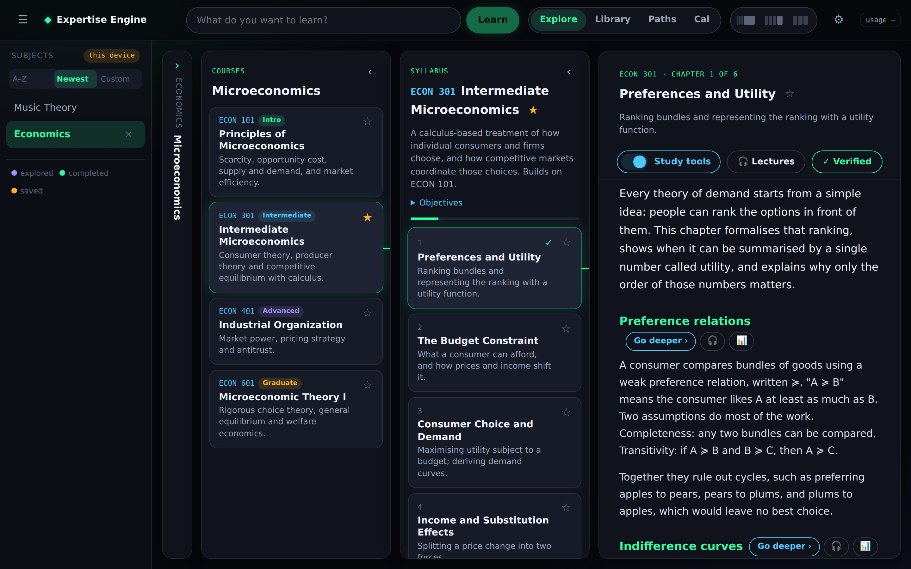
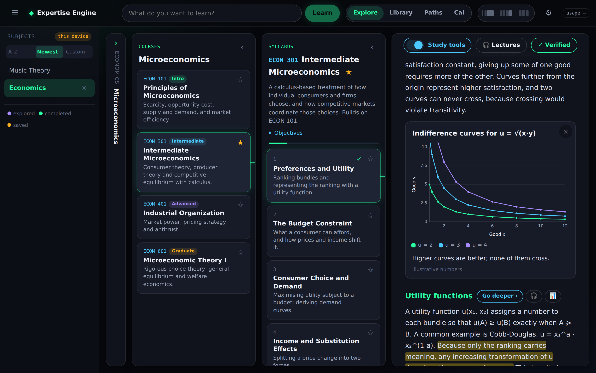
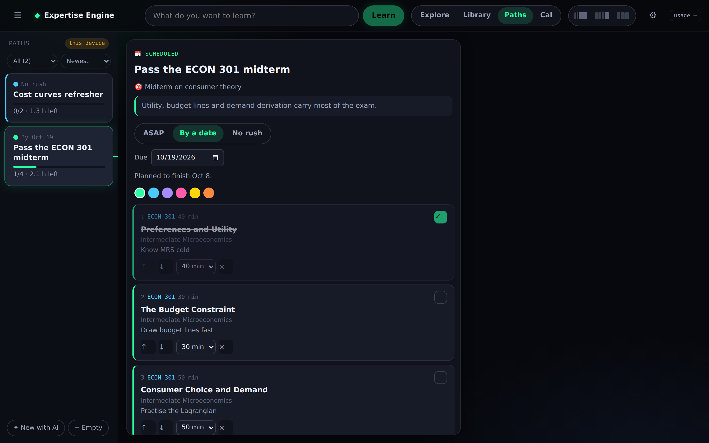
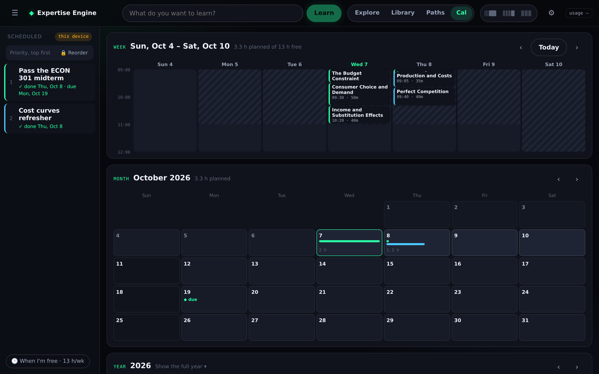
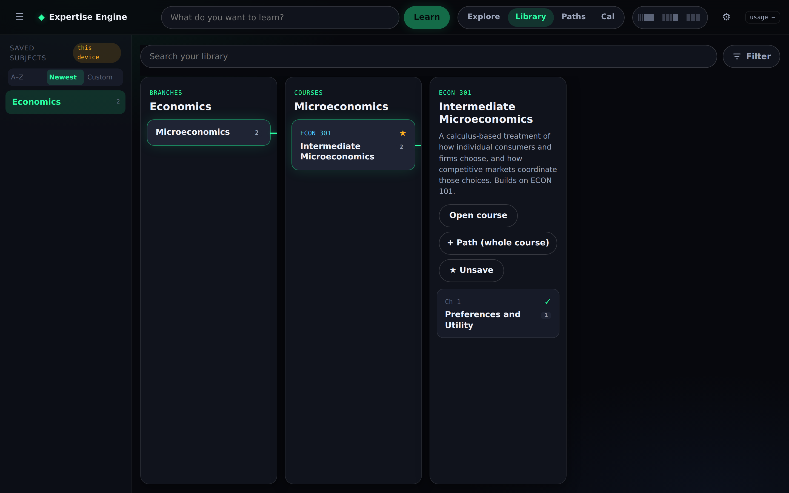
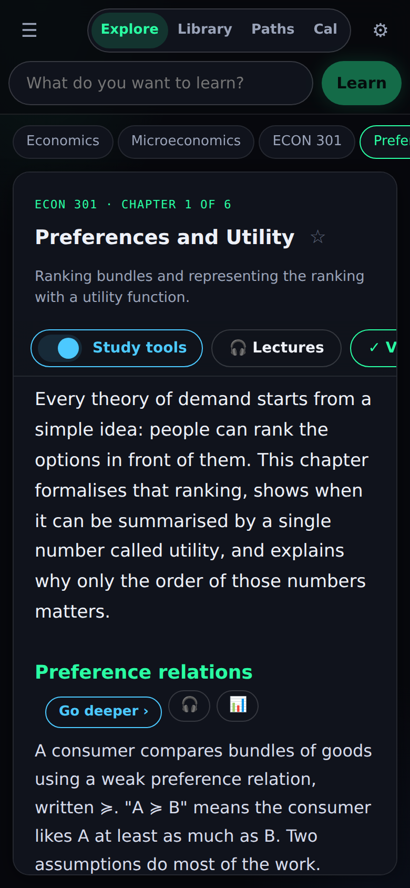

# Passive Expertise Engine (PEE)

Yes, the acronym is PEE. Type a subject, drill down like a university catalog, and read each chapter as it's written for you.



<table>
  <tr>
    <td width="50%"><br><sub>Chapters grow charts, deeper dives, quizzes and fact-checks</sub></td>
    <td width="50%"><br><sub>Paths: a goal-specific course built from your chapters</sub></td>
  </tr>
  <tr>
    <td width="50%"><br><sub>Cal: every path scheduled around your free time</sub></td>
    <td width="50%"><br><sub>Library: everything you saved, filed by subject</sub></td>
  </tr>
</table>



Open source under the [MIT license](LICENSE). Bring your own [OpenRouter](https://openrouter.ai) key: one key, any model. Your data stays in your own browser or your own Supabase project.

## Quick start

**1. Get a key (1 minute).** Create an account at [openrouter.ai](https://openrouter.ai), add a few dollars of credit, and make a key at [openrouter.ai/keys](https://openrouter.ai/keys). It starts with `sk-or-`. OpenRouter gives you every major model (DeepSeek, Claude, GPT, Gemini, Llama…) behind that one key.

**2. Try it on your computer (3 minutes, no accounts besides OpenRouter).**

```bash
git clone https://github.com/ZPARXMarketing/PassiveExpertiseEngine
cd PassiveExpertiseEngine
npm install
npm run dev
```

Open <http://localhost:5173>, click **⚙ Settings**, paste your key, and type a subject in the top bar. Everything is saved in your browser (the rail shows **this device**).

**3. Put it on the web (10 minutes).** Needs a free [Netlify](https://netlify.com) account.

1. Fork this repo, then in Netlify: **Add new site → Import an existing project** and pick your fork. The build settings come from `netlify.toml`.
2. **Site configuration → Environment variables**, add:

   | Variable | Value | Needed |
   | --- | --- | --- |
   | `OPENROUTER_API_KEY` | your `sk-or-…` key | yes |
   | `APP_PASSWORD` | any password; the whole site (and your OpenRouter credit) sits behind it | strongly recommended |

3. **Deploys → Trigger deploy.** Open the site, enter the password, type a subject.

**4. Sync across devices (optional, 10 minutes).** Create a free [Supabase](https://supabase.com) project, then:

1. Run every file in `supabase/migrations/` in filename order (Dashboard → SQL Editor, or `supabase db push`).
2. **Project Settings → API Keys**: copy the project URL and the publishable key (`sb_publishable_…`).
3. Add `VITE_SUPABASE_URL` and `VITE_SUPABASE_KEY` to Netlify's environment variables (keep **Builds** ticked: Vite reads them at build time) and redeploy. The rail should now say **synced**. For local dev put the same two lines in `.env.local`.

### Choosing your models

Defaults work out of the box. To change one, set the variable in Netlify and redeploy, or use any [OpenRouter model slug](https://openrouter.ai/models) (copy the slug from the model page):

| What it does | Variable | Default |
| --- | --- | --- |
| Writes subjects, courses, chapters, study tools | `OPENROUTER_MODEL` | `deepseek/deepseek-chat` |
| Fact-check (needs a web-searching model) | `OPENROUTER_FACTCHECK_MODEL` | `perplexity/sonar` |
| Paths: AI drafting from your goal or assignment (should accept images and PDFs) | `OPENROUTER_PATH_MODEL` | `google/gemini-3.8-flash` |
| Lectures (text to speech) | `OPENROUTER_TTS_MODEL` | `microsoft/mai-voice-2.1-flash` |

Lecture voice, style and speed are chosen in **Settings**; the voice list comes live from OpenRouter. If you'd rather not run a server, the Settings key and **Model** fields work on their own: that browser then calls OpenRouter directly with your key (and pays from it).

All variables are listed in [`.env.example`](.env.example).

## What it does

```
Subjects (left rail) → Branches → Courses → Syllabus → Chapter text
```

- **Top bar** — type any topic. It becomes a subject in the left rail (re-typing an existing one just opens it).
- **Panels** — each selection slides a new panel of buttons in to its right: the branches of the
  subject (e.g. Economics → Microeconomics, Econometrics…), the course catalog for a branch
  (code + Intro/Intermediate/Advanced/Graduate), then the course syllabus (description,
  objectives, ordered chapters).
- **Reader** — picking a chapter writes it: intro, sections, worked example, key terms, recap,
  self-check quiz. Previous / Next / Mark complete; the syllabus shows progress.
- Everything is generated **once** and saved, so going back is instant and free.
- **Every click is saved.** Explored tiles turn violet, completed chapters get a ✓, and opening
  the app on any device resumes at the last thing you clicked.
- **Folding panels.** Older panels fold out of the way (full → compact → slim strip) so the newest
  always fits — more aggressively on phones. ‹ folds a panel, tapping a strip opens it, ☰ hides
  the subject rail. On phones a breadcrumb trail jumps back to any level.
- **Each subject remembers where you were.** Hop Music → Physics → Chemistry → back to Music and
  you land exactly where you left Music, scrolled to the same spot in the chapter and panels.
  Tapping the subject you're already in keeps your place. Subjects from before trails were kept
  open at the last thing you opened in them. Trail synced; scroll position per device.
- **Explore | Library | Paths | Cal** switch in the top bar; the top bar and the panel switch
  stay put. Each mode keeps its list in the left panel, like Explore's subjects:
  - **Library** — your saved subjects (same A–Z / Newest / Custom sort), each opening into
    branch → course → chapter columns, then that chapter's highlights, lectures and star.
    **+ Path** on a chapter or a whole course adds it to a path.
  - **Paths** — every path, filtered **All / Scheduled / Not scheduled / Archived** and sorted
    (newest, recently changed, A–Z, due soonest, least time left, most progress), with
    **✦ New with AI** / **+ Empty** at the bottom (laid out like Cal). The open path shows on the right. New paths start
    *Not scheduled*; **📅 Schedule this path**, **Unschedule**, **🗄 Archive** / **Restore**.
    AI drafting: goal + pasted assignment + photos/PDFs → subject › branch › course › chapter
    steps (`google/gemini-3.8-flash`); **Create** reuses matches and generates anything missing.
  - **Cal** — the scheduled paths in **priority order** (top first) with their status (on track,
    late, doesn't fit, covered by a path above) and **When I'm free** at the bottom. **🔒 Reorder**
    unlocks dragging; the plan re-flows at once. Tap a path for its **rundown** (time planned,
    first → last session vs. its due date, every session by day); tap a session to open that
    hour and adjust it; **× full plan** goes back. If the order makes something late, a warning
    offers **Put due dates first**, **Keep my order** (accept it), or **Make it fit**.
- **Timing** per scheduled path: **ASAP**, **By a date** or **No rush**. The Cal order decides
  priority; timing only decides where a newly scheduled path joins it (ASAP on top, dated by due
  date, No rush at the bottom) and which dates it must make.
- **Cal plan** — every scheduled path together at three linked zoom levels, top to bottom **Week**, **Month**, **Year**. **Year** (one bar per
  path from first to last session, ◆ due dates, the part past a due date in red; tap to expand
  the weekly load: hours per week stacked by path against free time), **Month** (each day's time
  per path, due dates, red outline on days with work past a due date) and **Week** (sessions at
  their time of day over shaded free time; tap one to adjust: −5/+5 min, earlier/later, done,
  open). A month in the year moves the month view; a day moves the week. Tapping a path on the
  left opens its rundown and dims the others. Free time: plain words (AI → weekly blocks + busy
  days) or by hand. When it doesn't fit: **Shorten evenly** (15-min floor) or **✦ Make it fit
  with AI**.
- **Narrow windows** (split view): the page never scrolls sideways; Library gets a Subject
  dropdown, Paths mode a Paths | Schedule switch; older columns fold into strips.
- **Text size** A / A+ / A++ lives in Settings (this device).
- **Panel width switch** (top bar, three little layout pictures): Slim strips, Compact titles or
  Wide with summaries for the earlier panels. Tap the lit one again for Auto (fold to fit). Per device.
- **Sort the subject rail:** A–Z, Newest, or Custom: tap the 🔒 to unlock, drag subjects by their ≡
  handle, tap 🔓 to lock again. Synced.
- **Add to home screen** (Settings): shows the iOS Share → Add to Home Screen steps; it then opens
  full screen with its own icon.
- **Highlighter buckets.** Select text in a chapter (or a deeper dive) and tap a bucket — each has
  its own name and colour (Settings → Highlighter buckets: rename, recolour, add, hide). Marks stay
  on the text every visit, on every device. Tap a mark to move it to another bucket or remove it.
  The four original colours are the starter buckets, so older highlights keep their colour.
- **Study tools toolbar stays frozen** at the top of the chapter while you scroll.
- **Spend meter** (top right): OpenRouter spend on the site's key — all time · week · today, to
  three decimals. Turn it off in Settings.
- **Library tab** (pinned in the top bar). Search, plus one **Filter** button that pops open type, highlight colour and sort
  (badge = how many are changed; Reset / Done). **Sort → By colour** to see every highlight under its bucket with a link back to its chapter. ☆ any course or chapter, or highlight chapter text →
  **★ Save highlight**. Everything is filed automatically by subject → branch → course → chapter
  in catalog order (or recently saved / A–Z), fold any
  subject or course, Open all / Close all — and it reopens exactly how you left it.

## Study tools

A **Study tools** switch in the reader (off by default, synced across devices) reveals:

- **Go deeper ›** beside each section heading — a sub-lesson opens underneath, and its own
  sections can go deeper again (3 levels). With Study tools on, each deeper dive can be deleted.
- **Ask a question** about the chapter, and **Practice problems** with hidden worked solutions.

- **🎧 Lectures** (button in the chapter toolbar; a 🎧 badge on each section shows how many
  lectures already cover it). Tick the whole chapter or any mix of sections, pick Short (~3 min),
  Medium (~7) or Long (~12), and record. It records in the background — a pill in the corner shows
  progress and "Lecture ready". Keep as many versions as you like; each has play with speed,
  download, transcript and delete (removes the MP3 too). Lectures play in an app-wide
  player bar that keeps going when the sheet closes or you move around (lock-screen/headphone
  controls, ±15 s, speed); each lecture remembers where you stopped and shows ✓ Listened once
  finished, synced across devices. Every lecture is also under **Library → Lectures**. Voice model, voice, style and speed live in Settings (synced); the voice
  list comes live from OpenRouter so only supported voices are offered.
- **📊 Add a chart** for a section: the AI picks a line / bar / scatter / pie chart or a flow
  diagram (or draws the one you describe). Charts become part of that section for good, so each
  chapter grows into your own textbook. Invented numbers are labelled "Illustrative".

**Fact-check** (always visible once a chapter is written) checks the chapter against the web with
Perplexity Sonar and shows ✓ Verified or the flagged claims with corrections and sources.
**Fix these** (asks first) rewrites only the flagged parts; the corrected copy replaces the
original on screen and the badge becomes ✓ Corrected. Everything is generated once and saved.

## Generation

One streaming edge function, `netlify/edge-functions/generate.ts` (`POST /api/generate`), handles
every step; prompts and stream parsing live in `src/app/prompts.ts` and `src/app/parse.ts`.
Text appears while it is written, OpenRouter routes to the fastest provider, and the next chapter
is written in the background while you read.

- Writing: DeepSeek (`deepseek/deepseek-chat`). Fact-checks: `perplexity/sonar`.
- Lectures: `netlify/edge-functions/speech.ts` (`POST /api/speech`); default voice model `microsoft/mai-voice-2.1-flash` (voice Harper, en-US); any of OpenRouter's speech models can be chosen in Settings, and if the preferred one isn't listed the closest listed one is used. Raw-PCM models are saved as WAV.
- Models and keys: see [Choosing your models](#choosing-your-models).

## Password

`netlify/edge-functions/auth.ts` runs first on every path (declared in `netlify.toml`) and asks
for the password in the `APP_PASSWORD` site environment variable — pages, the app bundle and
`/api/*` are all behind it. Each device stays signed in (HttpOnly cookie, one year); changing the
password signs every device out; **Settings → Lock this device** signs one out. With
`APP_PASSWORD` unset the site is open.

## Storage

Two modes, chosen at startup:

- **Synced** — `VITE_SUPABASE_URL` and `VITE_SUPABASE_KEY` point at your own Supabase project with
  `supabase/migrations/` applied (tables `xe_*` plus the public `xe-lectures` bucket for lecture
  audio). The rail shows **synced**. RLS allows the anon role to read and insert, and to delete
  whole subjects only, so **keep the site behind `APP_PASSWORD`** (or tighten the policies for
  multi-user use): anyone holding the publishable key can read and write the tables.
- **This device** — with those variables unset, or the tables missing, everything lives in this
  browser's localStorage (the rail shows **this device**). Lecture audio lasts only for the visit.

## Run

```bash
npm install
npm run dev        # UI only; paste a key in Settings to generate
npx netlify dev    # UI + edge functions (set OPENROUTER_API_KEY / APP_PASSWORD in .env or `netlify env:set`)
npm run lint && npm run build
```
